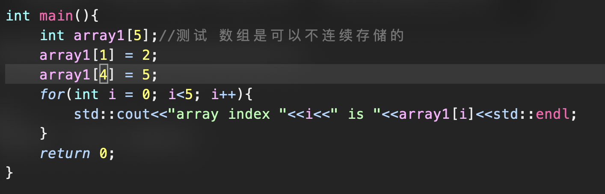
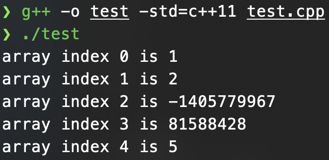

# 线性表
    def：线性表是具有相同数据类型的n个数据元素的有限序列，n为表长

## 线性表的顺序存储又叫顺序表
 i   def：用一组地址连续的存储单元依次存储线性表中的数据元素

note:顺序表的元素在逻辑和物理上都是相邻的(逻辑顺序和存储的物理顺序相同)

### 优点
    1.可进行随机访问，可以在O(1)的时间中找到元素
    2.存储密度高,每个结点只存储数据元素(感觉是与链表进行比对,链表还需要指针域)
### 缺点
  
  1.元素的插入和删除需要移动大量的元素,平均O(n/2)
    2.需要一段连续的内存空间,不够灵活

note:顺序表一定要连续存储,但是数组不一定



可以发现,数组元素都被初始化为 1,但是如果 index1-index2 两个地方的元素被修改,那么中间的元素也会被随机改变

## 链表:线性表的链式表示
[单链表](./SinleList.h)
```cpp
//single node
struct Node{
    Comparable value;
    Node* next;
}
```
[双链表](./DoubleList.h)
```cpp
// double node
struct Node{
    Comparable value;
    Node* prior,* next;
}
```

### 顺序表和链表的比较:
    1.存取(读写方法):
        顺序表可以顺序存取也可以随机存取,链表只能顺序存取
     2.逻辑结构和物理结构
        顺序表的逻辑结构和物理结构是统一的,链表则不是,逻辑相邻的元素物理上不一定相邻
     3.查找,插入和删除
        按值查找:如果元素无序两者都是O(n),有序顺序表可到 O(logn)
        按序查找:顺序表O(1),链表O(n)
        插入删除:顺序表需要移动平均 一般元素,链表只需更改指针
     4.链表更为灵活,但是存储密度更低(还需要存储指针)

 


