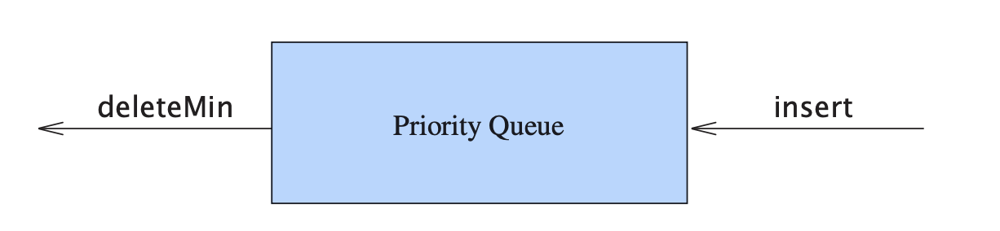
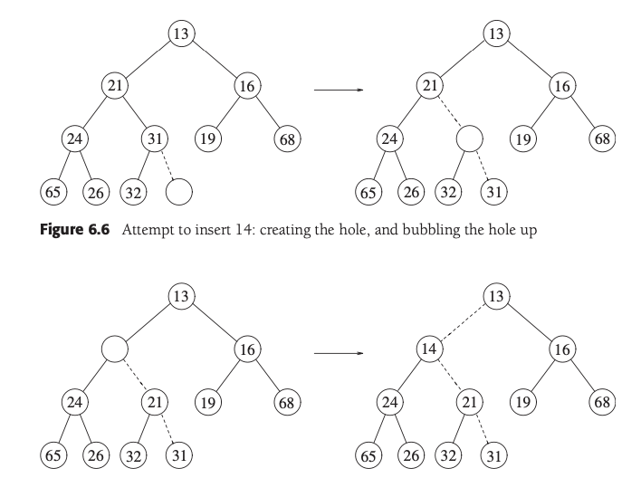
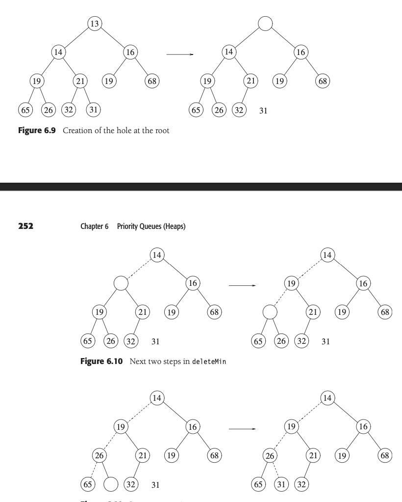

# 优先队列(堆)heap
至少允许insert和deleteMin两个操作的数据结构

一般说的是二叉堆(binary heap)

define:堆是一颗完全被填满的二叉树,叶子节点上的元素从左到右填入,这样的树也称为完全二叉树(complete binary tree)

    完全二叉树如此有规律,我们可以用一个数组实现它.[ , 1, 2, 3, ...],这里第一个位置是空的,从1开始计数,这样可以方便的找到父节点和子节点:数组第i个位置的元素的父节点是[i/2],左子节点是2i,右子节点是2i+1

### 堆序性质(heap-order property) 
    父节点小于子节点(最小堆),如此最小元总是在root处,从而findMin操作只需要常数时间

#### insert
    1.在最后一个位置创建一个hole,考察元素是否能直接放进hole,如果可以,则插入完成
    2.否则交换父节点和hole,再进行考察,直到可以插入为止(或到达root)
    *这种操作称为上滤* percolate up

#### deleteMin
    1.删除root后,在root处生成一个hole,考察最后一个元素X,如果X可以放在hole处,则结束
    2.不然挑选两个子节点中较小的一个,放在hole处,再进行考察,直到可以插入为止(或到达叶子节点,此时直接将X移动道hole处)
    *这种操作称为下滤* percolate down

### heap的应用

    find k-max,找到第k大的元素
    1.构建一个最大堆,然后执行k次deleteMax,得到第k大的元素.这样的时间复杂度是O(n+klogn)<抽象来说就是改变堆的序性质>
    2.或者沿用最小堆,创建一个长度为k的集合,保留输出值中最大的k个元素,然后不断的deleteMin,只要新元素比集合中最小的大,就做替换,这样得到了前k个最大元
### summary
    堆是一种数据结构,可以用数组实现,堆序性质保证了最小元总是在root处,从而findMin操作只需要常数时间
    d堆,就是每个节点有d个子节点的完全二叉树
    两个堆的合并是相当困难的,因为序信息在堆中丢失太多

    