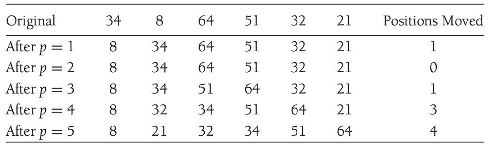
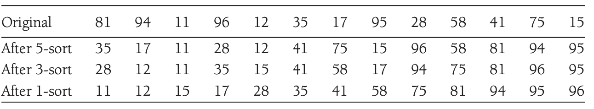
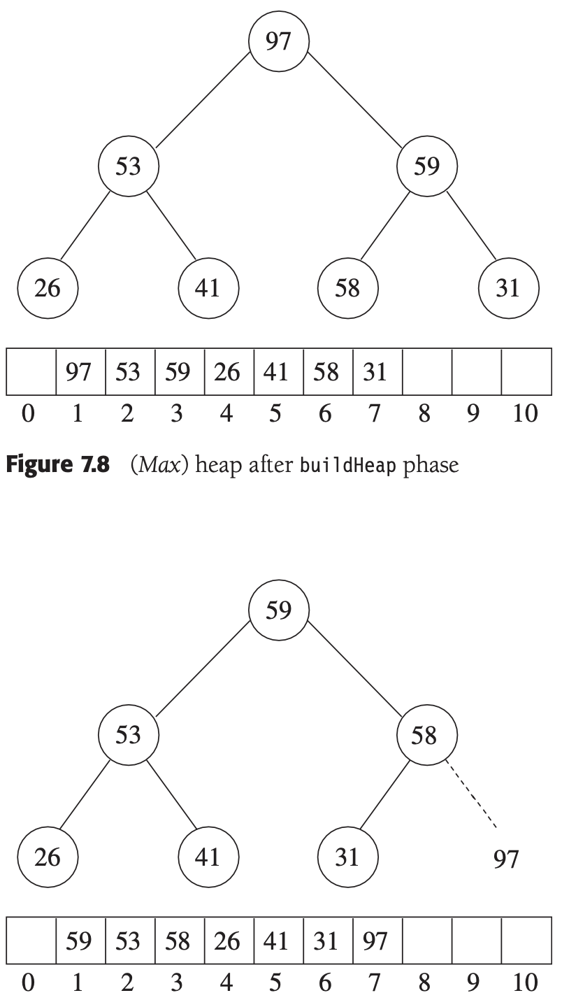
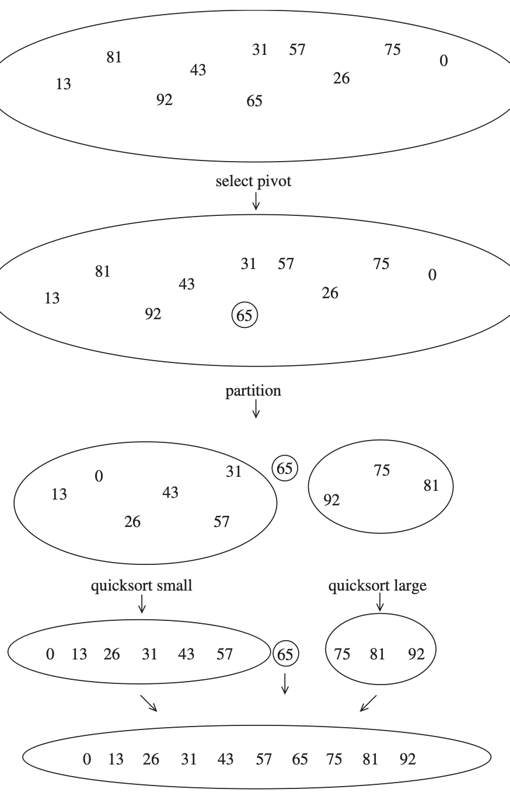
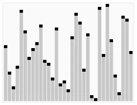
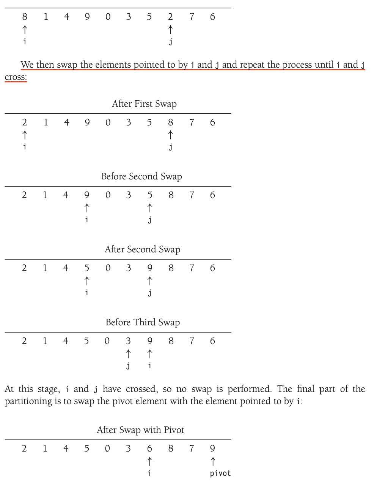

# 排序(sorting)

## 插入排序(insertion sort)
    由N-1趟排序组成,第k次排序保证前k个元素有序,下一次排序的时候读取第k+1个元素并逐个与前k个元素比较,找到合适的位置插入

时间复杂度: $O(N^2)$

## 希尔排序(shell sort)
    希尔排序是插入排序的改进版,通过比较相距较远的元素来提高插入排序的效率,并不是每次都比较相邻的元素,而是比较相隔一定间隔的元素,这样可以让元素移动的时候更快,从而提高效率 

最坏运行时间为$O(N^2)$,如果采用Hibbard增量$\{1,3,..,2^k-1\}$,最坏运行时间为$O(N^{3/2})$

## 堆排序(heap sort)
heap可以用于以$O(N\log N)$时间的排序:建一个二叉堆,然后反复执行$deleteMax$操作,把元素存储进一个新的数组,然后再复制回来

建立一个二叉堆花费$O(N)$时间,每次$deleteMax$需要$O(\log N)$时间,因此总的时间复杂度为$O(N\log N)$.

算法的主要问题在于相对于shell_sort或者insertion_sort,它多使用了一个数组,因此空间上的开销比较大,解决这个问题的一个方法是,每次deleteMax的时候,把最大的元素放到数组的最后,这样就不需要额外的数组了,最终我们能得到一个递增的数组(如果建立的是最小堆,则得到一个递减的数组<好好想想>)

#### 对N个互异项的随机序列堆排序所用的比较的平均次数为$2N\log N-O(N\log\log N)$

## 归并排序(merge sort)
归并排序是一种分治算法,用于合并两个已经排序了的数组,时间复杂度为$O(N\log N)$

## 快速排序(quick sort)
快速排序是一种分治算法:对于数组S
    
    1.如果S中元素为0或者1,返回
    2.取S中任意一个元素v,称为枢纽元(pivot)
    3.将S-{v}分成两个不相交的集合S1和S2,其中S1中的元素小于v,S2中的元素大于v
    4.返回quick_sort(S1),v,quick_sort(S2)

    1.选择枢纽元的一个好的方法是随机选择,或者使用三数中值分割法,即选择S[0],S[N/2],S[N-1]中的中值作为枢纽元
    2.分割的时候采用的策略是:
        先将v和S的最后一个数交换,然后做两个指针i,j.一开始i指向第一个元素,j指向倒数第二个元素,然后让i左移,j右移,直到i指向一个大于v的元素,j指向一个小于v的元素,然后交换i和j指向的元素,重复这个过程,直到i和j相遇,最后交换i指向的元素和v,这样就完成了一次分割

快速排序的时间复杂度为$O(N\log N)$,
