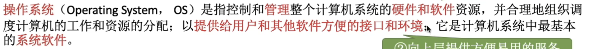

# 操作系统
 

1.是系统资源的管理者

     
    处理机管理:是进程管理吗?

2.提供接口和环境
 
    
    比如GUI,联机命令接口(terminal),批处理命令接口(.bat 文件,.sh 文件等等)
    程序接口等等(由操作系统提供,供程序员使用等等)

3.是系统软件 

# 操作系统的四大特征

    
    并发:宏观上同时发生, 微观上交替发生
    并行:微观上同时发生 

超过 4 个就需要并发性

共享方式对应的也有互斥共享方式和同时共享方式(微观上可能是交替共享也可能是同时共享)

    比如一块硬盘分成几个盘(D,E)
    时分复用技术:单核 cpu 系统同时运行几个引用程序

## 总结

# 操作系统发展

    多道批处理系统时期 OS 才出现
    分时操作系统:交互功能出现
    

# 总结
 

# 操作系统的运行机制

# 总结

 
# 中断和异常  

操作系统夺回cpu使用权的唯一方式就是中断

    内中断:比如应用程序企图使用特权指令,或者数组越界需要处理(转到 OS 处理异常),
        或者陷入指令(应用程序希望 OS 为他提供某些操作),陷入指令不是特权指令
    外中断:时钟中断(实现并发),I/O中断请求等等

# 总结
 

# 系统调用

# 操作系统的体系结构

# 虚拟机

