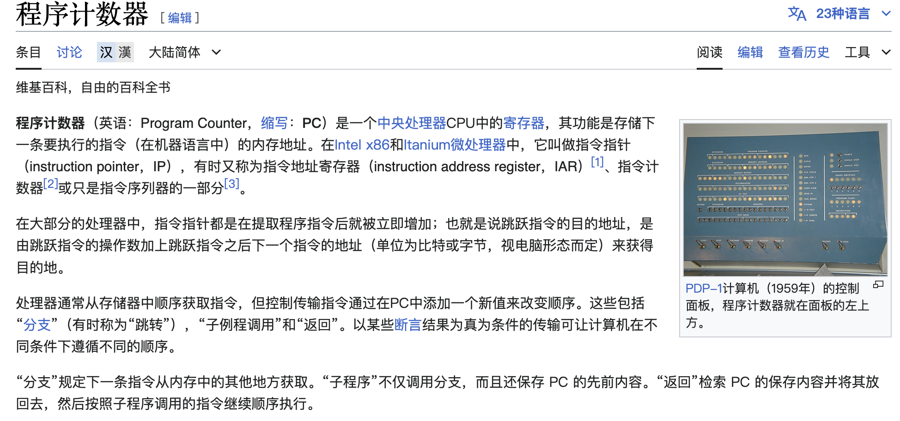
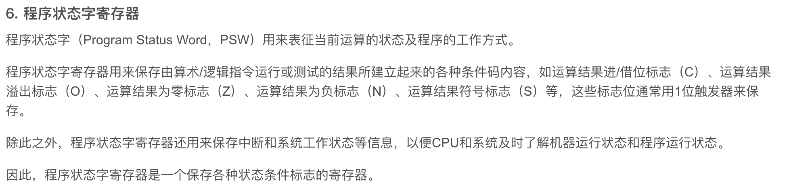

提高单机资源利用率的关键技术是多道程序设计技术,虚拟技术和交换技术以多道程序设计技术为前提

引入多道程序设计技术后,程序的执行就失去了封闭性和顺序性

要求快速响应用户是分时操作系统出现的重要原因

现代操作系统都是多任务的,允许用户将把程序分成多个独立的任务,在宏观上并行执行,微观上并发,如果是多处理器系统,则是真正的并行执行

[通用操作系统](https://baike.baidu.com/item/%E9%80%9A%E7%94%A8%E6%93%8D%E4%BD%9C%E7%B3%BB%E7%BB%9F/8459872):具有多种类型操作特征的操作系统。可以同时兼有多道批处理、分时、实时处理的功能，或其中两种以上的功能。

    通用操作系统使用时间片轮转调度算法,用户程序不需要向系统预定运行时间,系统会自动分配时间片 
    操作系统执行程序时,必须从起始地址开始执行

计算机通过**硬件**实现用户态到核心态的转换,从核心态到用户态的转换是由操作系统完成的
    
    错误的观点有:用户态到核心态是由:
        1.核心态程序完成:不可能,因为转换之前在用户态
        2.用户程序:不可能,这样用户能操作特权指令
        3.中断处理程序:不可能,这一般是在操作系统内核态执行的

系统调用的执行一定在内核态,但是系统调用的调用者可以是用户态程序

处于核心态的 CPU 可以执行指令系统中的所有指令

[访管指令](https://baike.baidu.com/item/%E9%99%B7%E5%85%A5%E6%8C%87%E4%BB%A4/8987616):也称陷入指令,是应用程序请求操作系统介入的时候执行的指令

库函数是封装在库文件中的可复用代码快,运行在用户态,系统调用是面向硬件的,运行在内核态,是操作系统为用户提供的接口
        
    库函数方便调试,方便切换,开销很小
    系统调用很麻烦,运行在核心态,需要切换,开销很大

[程序计数器PC(Program Counter)](https://zh.wikipedia.org/wiki/%E7%A8%8B%E5%BC%8F%E8%A8%88%E6%95%B8%E5%99%A8!)

[程序状态字寄存器PSW(Program Status Word)](https://baike.baidu.com/item/PSW/1878339)

[通用寄存器](https://baike.baidu.com/item/%E9%80%9A%E7%94%A8%E5%AF%84%E5%AD%98%E5%99%A8/2839785)

处理外部中断的时候,程序计数器 PC 由中断指令保存,通用寄存器的数据由操作系统保存,块表,cache中的内容由硬件机构保存

微内核:

    基本概念:将操作系统分为两大部分:微内核和多个服务器,微内核只提供最基本的功能,其他功能由服务器提供
            微内核通常包括:
                    1.与硬件紧密相连的部分
                    2.一些基本功能
                    3.客户和服务器之间的通信
            微内核的基本功能:
                    1.进程(线程)管理,
                    2.低级存储器管理:比如如何实现将逻辑地址转化为物理地址的机制就应该在微内核中实现
                        但是如如何分配物理内存,实现回收等等,则应该在服务器中实现
                    3.中断和陷入处理:识别中断和陷入后,将控制权交给相应的服务器
            微内核的特点:
                实现了高可靠性,高灵活性,高可扩展性
                可移植性
                分布式计算
                主要缺点是是需要频繁的在核心态和用户态之间切换,导致性能下降

ROM(只读存储器),SRAM(静态随机存取器),DRAM(动态随机存取器)

[中断向量表](https://zhuanlan.zhihu.com/p/481094329)

层次结构最大的不足是设计困难:需要对每一层进行精心的划分和设计,保证接口的一致性和完备性

模块化操作系统由于各个模块相互调用,一旦某个模块出现问题可能导致整个系统崩溃

操作系统的引导程序位于磁盘活动分区的引导扇区中,引导程序分为两种,一种是位于 ROM 中的自举程序(BIOS 的组成部分),用于启动具体的设备;另一种是位于装有操作系统的活动分区的引导扇区中的引导程序
(称为启动管理器),用于引导操作系统.<计算机的引导程序位于硬盘中>

#### 计算机启动过程:

    激活 CPU (读取 ROM 中的 boot 程序,将指令寄存器设置为 BIOS 的第一条指令,也就是开始执行 BIOS 的指令) 
    -> 硬件自检: BIOS 构建中断向量表,检查硬件
    -> 加载带有操作系统的硬盘:读取 Boot Sequence ,将控制权交给启动顺序在第一位的存储设备
        (或者和用户交互,比如双系统选择进入 ubuntu 还是 Windows 的时候出现的界面)
        然后CPU 将存储设备引导扇区的内容加载到内存中
    ->加载主引导记录(MBR)<作用是告诉 CPU 硬盘的哪个分区找操作系统>:检查存储设备是不是可引导盘,不是就到下一个存储设备
    ->扫描硬盘分区表,加载硬盘活动分区:将控制权交给活动分区(操作系统在这里)
    ->加载分区引导记录(PBR):这是活动分区的第一个扇区,寻找并激活根目录下用于引导操作系统的程序(启动管理器)
    ->加载启动管理器
    ->加载操作系统:将操作系统的初始化程序加载到内存中开始执行

