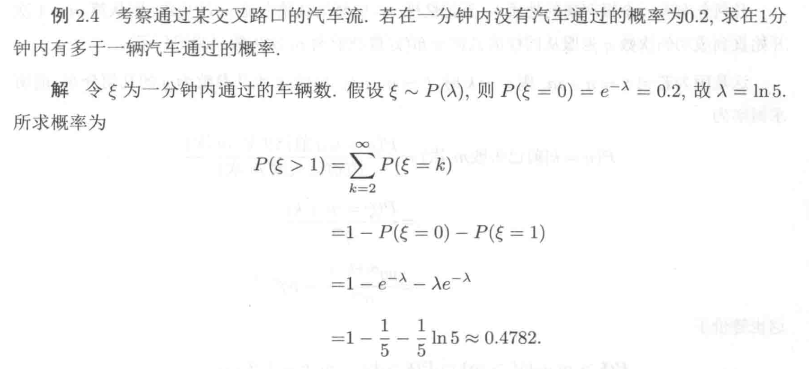

# poisson分布
$$\xi\sim P(\lambda)$$

<ol>
<li>这里的$\lambda$是一个正实数,实际上它就是 $\xi$的均值,同时也是方差.它用来反映单位时间内可能的需求量对应的概率是多少,要创建一个poisson分布,只需要确定参数$\lambda$,比如平均状态下一分钟内打进的电话数是7,那么$\lambda=7$ ,每分钟打进来的电话个数就服从poisson分布$P(7)$ </li>
<li> $\xi\in N,P(\xi=k)=\frac{\lambda^k}{k!}e^{-\lambda} $</li>

<li>$F(k;\lambda)=\sum\limits_{i=0}^k \frac{\lambda^i}{i!}e^{-\lambda} $

<li>$E\xi=\lambda$</li>

<li>$Var\xi=D\xi=\lambda$</li>

<li>特征函数:$f(t)=e^{\lambda(e^{it}-1)}$</li>
    $here:f(t)=\sum\limits_{k=1}^\infty\frac{\lambda^k}{k!}e^{-\lambda}e^{itk}= \sum\limits_{k=1}^\infty\frac{(\lambda e^{it})^k}{k!}e^{-\lambda}=e^{-\lambda}e^{\lambda e^{it}}= e^{\lambda(e^{it}-1)}$,用到了$e^x=\sum\limits_{k=0}^\infty \frac{x^k}{k!} $</li>

</ol>

不能直接得到$\lambda$的情况:

否则可以直接写出分布
