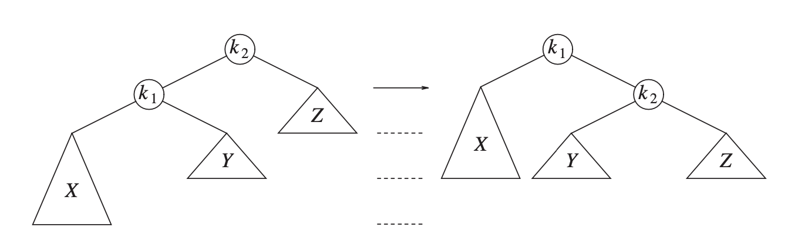
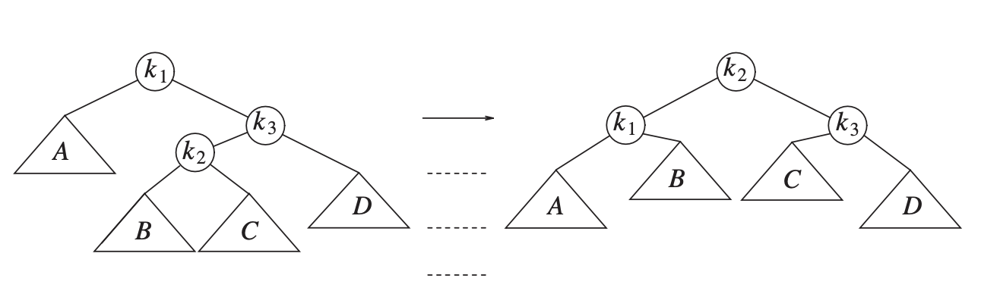

# 树(tree)

一般来说树使用递归来定义:一棵树是一些node的集合
实际上树的节点可以有很多儿子,但是一般讨论二叉树,所以节点也定义为两个儿子的节点
```c++
class node{
    int val;
    node *left;
    node *right;
}
```
depth:root到这个节点的路径长度

height:这个节点到叶子节点的最长路径长度

树的高度:根节点的高度,空树的高度定义为-1

## 二叉树(binary tree):每个节点不多于两个儿子的树

```c++
struct BinaryNode{ 
    int val;
    BinaryNode *left;
    BinaryNode *right;
}
```
    表达式树:树叶是操作数,其余的节点都是操作符

### 二叉查找树(binary search tree):对于每个节点,左子树的所有节点都小于这个节点,右子树的所有节点都大于这个节点

方法:

```c++
//contains
bool contains(int x,BinaryNode *t){
    if(t==nullptr) return false;
    else if(x<t->val) return contains(x,t->left);
    else if(x>t->val) return contains(x,t->right);
    else return true;
}
//同理递归的去写findMin,findMax,insert,remove
```

这里remove带来了一个问题,当remove一个元素以后,剩下的两个儿子(可能没有)谁去继承父位

<u>一般的做法是让右子树的最小值继承父位,这样可以保证树的平衡性</u>

一棵树的所有节点深度和称为内部路径长(internal path length)

### 平衡二叉树(AVL tree):对于每个节点,左子树和右子树的高度差不超过1


#### 执行Insert和remove操作后,可能会破坏平衡性,因此需要进行旋转操作
左旋转:
有时候需要双旋转,先左旋转,再右旋转:



双旋的时候把最高的孩子的‘root’找到,作为一个相对独立的节点,然后进行单旋转

### 伸展树(splay tree):保证了从空树开始任意连续M次操作最多花费$O(MlogN)$的时间,注意单次的时间可能到达$O(N)$,它的基本想法是,每次访问一个节点时,将其旋转到根节点,如果一个节点很深,那么其路径上的很多节点也会很深,这样旋转以后这些节点都变浅了

### B树(B-tree)
    阶为M的B树:
    1.数据全部存储在叶子上
    2.非叶子结点存储索引(搜索的方向)
    3.树的根或者是树叶,或者至少有两个儿子
    4.除了根和树叶外,每个节点至少有[M/2]个儿子,至多有M个儿子
    5.所有叶子都在同一层


