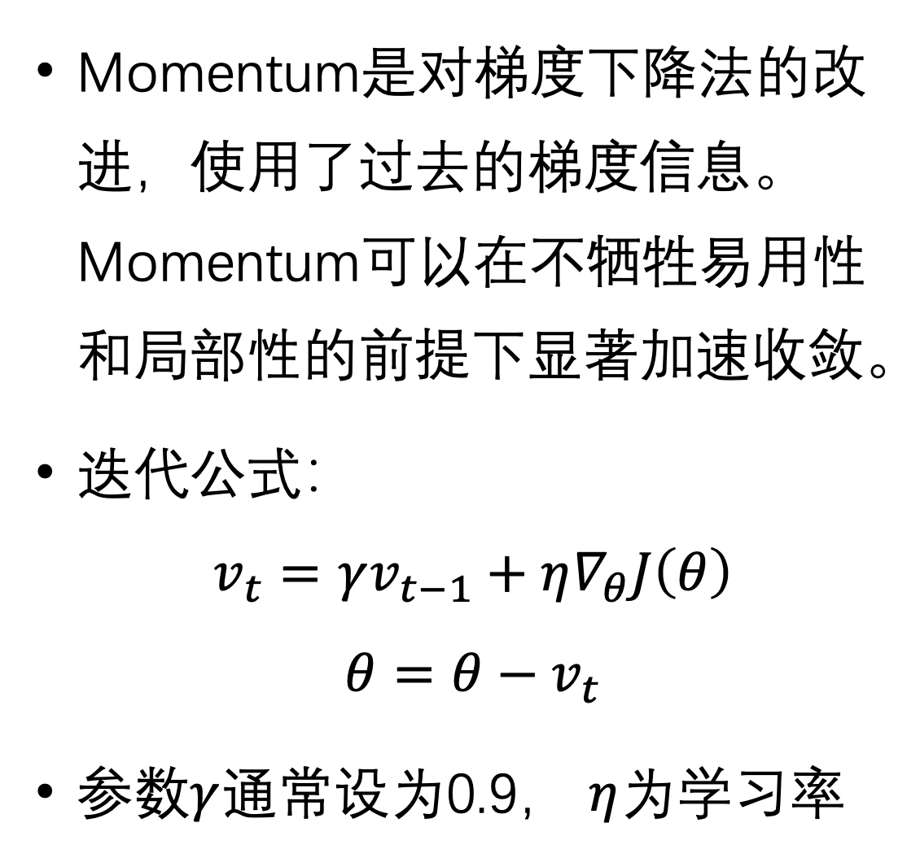

# 梯度下降法
一元的例子
 $ f(x_{i+1}) = f(x_i)-f'(x_i)\Delta x $

    对应的，最小二乘的拟合实际上就是对误差函数做最小化，这时候自变量是需要拟合的参数

# 批梯度下降法(BGD)
[知乎解答](https://zhuanlan.zhihu.com/p/72929546)   

    就是在计算梯度的时候使用整个数据集的数据来计算(注意需要平均),这样得到的梯度能精确的反应整个数据集的变化方向，缺点是数据集很大的时候计算很慢

$ f_{new} = f_{old} - h\frac{1}{n}\sum\limits_{i=1}^n f'_i $

# 小批量梯度下降法
    每次迭代的时候随机从数据库中选择一小部分数据进行梯度计算

# 随机梯度下降法
    在一轮过程中遍历整个训练集，但是每次计算只用一个数据，这样得到的曲线震荡性很大

# 梯度下降法的拓展
## Momentum
 

    实际上这里的$\gamma$就是沿用前面的数据的意思，后面$\eta$负责更新梯度

后面的直接看pdf，其实大同小异

